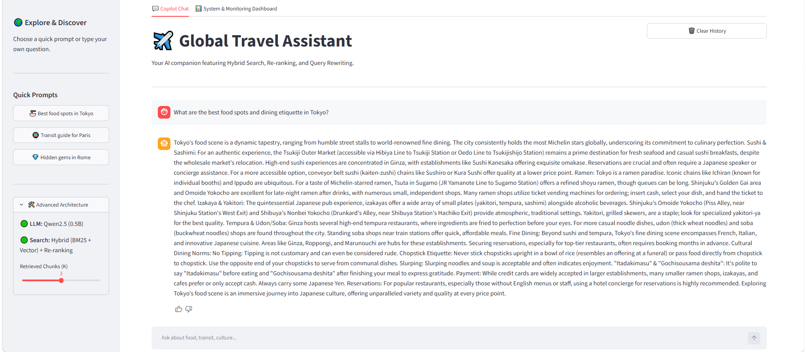
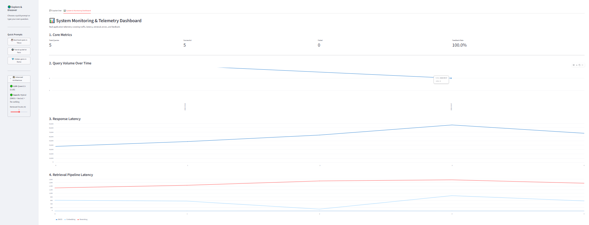
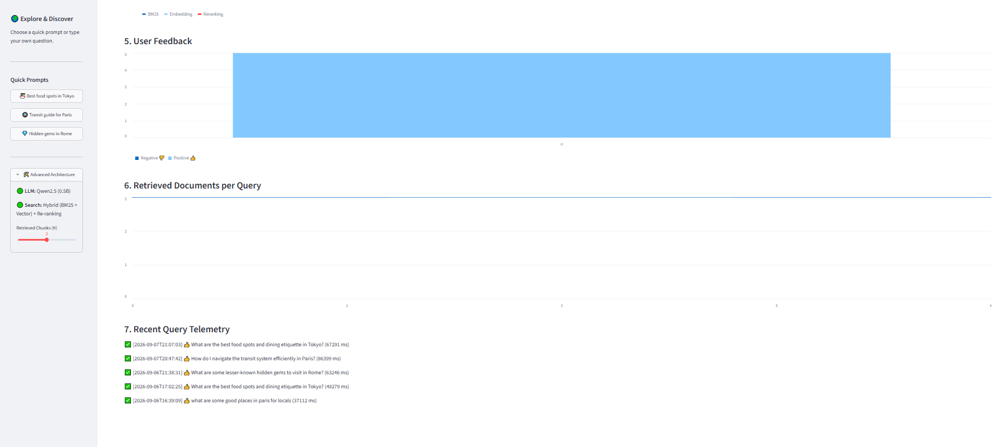

# RAG Travel Assistant

An end-to-end, production-oriented local Retrieval-Augmented Generation (RAG) application for travel planning. The system combines automated data ingestion, hybrid retrieval, Reciprocal Rank Fusion (RRF), CrossEncoder re-ranking, query rewriting, local LLM generation, user feedback, and application telemetry.

## Problem Description

Travel information is often fragmented across different guides and sources, making it difficult for travelers to quickly find relevant, contextual information about food, transportation, culture, hidden attractions, and safety.

This project addresses the problem by building a local RAG travel assistant that retrieves relevant information from a structured travel knowledge base and uses a local LLM to generate grounded answers. The system combines semantic vector search, BM25 keyword search, Reciprocal Rank Fusion (RRF), CrossEncoder re-ranking, and query rewriting to improve retrieval quality without relying on external LLM APIs.

The application is designed as a reproducible portfolio and evaluation project demonstrating how a complete RAG system can be built, evaluated, monitored, and containerized locally.

## Dataset

The project uses a synthetic travel benchmark corpus covering 10 cities and 5 travel categories, producing up to 50 structured travel documents.

### Cities

- Tokyo
- Paris
- Rome
- New York
- Bangkok
- London
- Barcelona
- Kyoto
- Reykjavik
- Cairo

### Categories

- Food & Dining
- Transit & Navigation
- Culture & Etiquette
- Hidden Gems
- Safety & Emergencies

The documents are generated locally using Qwen2.5 0.5B through Ollama and validated using Pydantic structured output.

The corpus is intended as a controlled benchmark for demonstrating and evaluating the RAG pipeline rather than as an authoritative source of travel advice.

## Project Structure

```text
├── assets/
│   ├── chat_screenshot.png
│   └── dashboard_screenshot.png
│   └── user_feedback.png
├── data/
│   ├── evaluation_report.json
│   ├── llm_evaluation_report.json
│   └── travel_docs_structured.json
├── src/
│   ├── app.py
│   ├── generate_data.py
│   ├── ingest.py
│   ├── rag_chain.py
│   ├── evaluate.py
│   └── evaluate_llm.py
├── Dockerfile
├── docker-compose.yaml
├── requirements.txt
├── travel_copilot_ingest.duckdb
└── README.md
```

## System Architecture & Tech Stack

- **UI & Monitoring:** Streamlit application featuring an interactive chat interface, user feedback collection, RAG tracing, and a telemetry dashboard.
- **LLM Engine:** Local Qwen2.5 0.5B powered by Ollama.
- **Embeddings:** Nomic Embed (`nomic-embed-text`) executed locally through Ollama.
- **Vector Database:** ChromaDB persistent vector storage.
- **Keyword Search:** BM25 using `rank_bm25`.
- **Retrieval Fusion:** Reciprocal Rank Fusion (RRF).
- **Re-ranking:** CrossEncoder using `cross-encoder/ms-marco-MiniLM-L-6-v2`.
- **Data Ingestion:** Automated `dlt` pipeline with DuckDB staging.
- **Containerization:** Docker and Docker Compose.

## RAG Pipeline

The application follows this retrieval and generation flow:

```text
Synthetic Travel Corpus
        ↓
generate_data.py
        ↓
dlt Ingestion
        ↓
DuckDB
        ↓
ChromaDB + BM25
        ↓
User Query
        ↓
Query Rewriting
        ↓
Vector Search + BM25
        ↓
Reciprocal Rank Fusion (RRF)
        ↓
CrossEncoder Re-ranking
        ↓
Top-K Context
        ↓
Qwen2.5 0.5B
        ↓
Grounded Answer + Sources
        ↓
Telemetry + User Feedback
```

## App Screenshots

### Streamlit Chat Interface



### Telemetry & Monitoring Dashboard




## Advanced Features & Optimizations

### 1. Query Rewriting

The user's question is rewritten using Qwen2.5 0.5B before retrieval. The rewritten query preserves important information such as the destination, topic, and search keywords.

### 2. Hybrid Search

The system combines two retrieval approaches:

- Semantic vector similarity search using ChromaDB and Nomic embeddings.
- Lexical keyword search using BM25.

The two result lists are combined using Reciprocal Rank Fusion (RRF).

### 3. Document Re-ranking

Candidate documents from the hybrid retrieval stage are re-ranked using a CrossEncoder model:

```text
cross-encoder/ms-marco-MiniLM-L-6-v2
```

This provides a second relevance-ranking stage before documents are passed to the generation model.

### 4. Local LLM Generation

The final answer is generated locally using Qwen2.5 0.5B through Ollama. The generation prompt instructs the model to use only the retrieved travel context and avoid unsupported claims.

## Monitoring & Analytics Dashboard

The application records interaction telemetry locally in:

```text
app_analytics.json
```

The Streamlit dashboard tracks:

- Total queries
- Successful requests
- Failed requests
- User feedback and feedback rate
- Query volume over time
- Total response latency
- Embedding latency
- BM25 retrieval latency
- CrossEncoder re-ranking latency
- Number of retrieved documents
- Recent query telemetry
- RAG traces containing rewritten queries and retrieved sources

User feedback is associated with a unique interaction ID so that feedback can be connected to the corresponding query.

## Configuration

The application supports the following environment variables:

| Variable | Default | Purpose |
|---|---|---|
| `OLLAMA_MODEL` | `qwen2.5:0.5b` | Local generation and query rewriting model |
| `EMBEDDING_MODEL` | `nomic-embed-text` | Embedding model |
| `RERANKER_MODEL` | `cross-encoder/ms-marco-MiniLM-L-6-v2` | CrossEncoder re-ranking model |
| `OLLAMA_HOST` | Ollama default | Ollama server address |

For local execution, the default model values can be used without creating a `.env` file.

## How to Run the Project

### 1. Clone the Repository

```bash
git clone https://github.com/imentouatii/rag-travel-assistant.git
cd rag-travel-assistant
```

### 2. Create a Python Environment

```bash
python -m venv travel-copilot-env
```

#### Windows PowerShell

```powershell
.\travel-copilot-env\Scripts\Activate.ps1
```

#### macOS / Linux

```bash
source travel-copilot-env/bin/activate
```

### 3. Install Dependencies

```bash
pip install -r requirements.txt
```

### 4. Install and Start Ollama

Make sure Ollama is installed and running.

Pull the required models:

```bash
ollama pull qwen2.5:0.5b
ollama pull nomic-embed-text
```

The CrossEncoder re-ranking model is downloaded automatically by `sentence-transformers` when first used.

### 5. Generate the Synthetic Dataset

Generate the structured travel benchmark corpus:

```bash
python src/generate_data.py
```

This creates:

```text
data/travel_docs_structured.json
```

### 6. Run the Ingestion Pipeline

Load the generated documents through the `dlt` pipeline into DuckDB and then index them in ChromaDB:

```bash
python src/ingest.py
```

The resulting ChromaDB data is stored in:

```text
data/chroma_db/
```

### 7. Launch the Streamlit Application

```bash
streamlit run src/app.py
```

The application will be available at:

```text
http://localhost:8501
```

## Evaluation

The project includes separate retrieval and LLM evaluation scripts.

### Retrieval Evaluation

The retrieval benchmark compares four approaches:

1. Vector similarity search
2. BM25 keyword search
3. Hybrid Vector + BM25 using Reciprocal Rank Fusion (RRF)
4. Hybrid RRF + CrossEncoder re-ranking

The benchmark uses multiple travel queries with relevance labels derived from the known city/category structure of the synthetic corpus.

The following metrics are calculated:

- Hit@5
- Recall@5
- Precision@5
- MRR@5

Run the retrieval evaluation:

```bash
python src/evaluate.py
```

Results are saved to:

```text
data/evaluation_report.json
```

### Retrieval Results

| Strategy | Hit@5 | Recall@5 | Precision@5 | MRR@5 |
|---|---:|---:|---:|---:|
| Vector | 0.533 | 0.267 | — | 0.533 |
| BM25 | 0.533 | 0.400 | — | 0.240 |
| Hybrid RRF | 0.533 | 0.267 | — | 0.533 |
| **Hybrid RRF + CrossEncoder** | **0.533** | **0.533** | — | **0.533** |

The final retrieval strategy is **Hybrid RRF + CrossEncoder re-ranking**, selected because it achieved the highest Recall@5 while maintaining the highest MRR@5.

The benchmark contains 15 manually defined travel queries. Relevance labels are derived from the known city/category metadata of the synthetic corpus rather than human annotations, so these results should be interpreted as a controlled benchmark rather than a human relevance study.

### LLM Results

| Prompt Strategy | Fact Coverage | Completeness | Quality Score |
|---|---:|---:|---:|
| Concise Grounded | 0.800 | 0.270 | 0.694 |
| **Structured Expert** | **0.883** | **0.533** | **0.813** |

The final application uses the **Structured Expert** prompting strategy because it achieved the highest fact coverage, completeness, and combined quality score.

Fact coverage measures the proportion of predefined facts from the supplied evaluation context that appear in the generated answer. Completeness is a heuristic based partly on response length, so these results should be interpreted as a controlled benchmark rather than human evaluation or LLM-as-a-judge assessment.

Run the LLM evaluation:

```bash
python src/evaluate_llm.py
```

Results are saved to:

```text
data/llm_evaluation_report.json
```

### LLM Results

| Prompt Strategy | Fact Coverage | Completeness | Quality Score |
|---|---:|---:|---:|
| Concise Grounded | TBD | TBD | TBD |
| Structured Expert | TBD | TBD | TBD |

The final prompt strategy is selected based on the measured benchmark results.

## Docker Deployment

The application can be run using Docker Compose:

```bash
docker compose up --build
```

The Streamlit application is exposed on port `8501`.

The application container connects to Ollama running on the host machine through:

```text
http://host.docker.internal:11434
```

Make sure Ollama is running on the host and that the required models have already been downloaded:

```bash
ollama pull qwen2.5:0.5b
ollama pull nomic-embed-text
```

Then open:

```text
http://localhost:8501
```

### Docker Architecture

```text
┌──────────────────────────────┐
│       Docker Container       │
│                              │
│  Streamlit + RAG Application │
│  ChromaDB + BM25 + Reranker  │
└──────────────┬───────────────┘
               │
               │ HTTP
               ↓
┌──────────────────────────────┐
│       Ollama on Host         │
│                              │
│       Qwen2.5 0.5B           │
│       Nomic Embed Text       │
└──────────────────────────────┘
```

## Reproducibility

The project is designed to be reproducible using the provided dependency file, dataset generation script, ingestion pipeline, evaluation scripts, and Docker configuration.

A fresh setup follows:

```text
Install dependencies
        ↓
Start Ollama
        ↓
Pull required models
        ↓
Generate synthetic dataset
        ↓
Run dlt ingestion
        ↓
Build ChromaDB index
        ↓
Run evaluations
        ↓
Launch Streamlit
```

The main configuration values are controlled through environment variables where appropriate.

## Limitations

- The travel corpus is synthetic and may contain factual inaccuracies.
- The corpus is intended for RAG experimentation and benchmarking rather than authoritative travel advice.
- Retrieval evaluation uses relevance labels derived from the known city/category structure of the synthetic benchmark rather than human-annotated relevance judgments.
- LLM evaluation uses predefined context facts and heuristic metrics rather than human evaluation.
- The system is optimized for local experimentation and portfolio demonstration rather than large-scale production deployment.
- The local Qwen2.5 0.5B model provides a lightweight setup but has lower generation capabilities than larger language models.

## Example Queries

The application can be tested with questions such as:

```text
What are the best food spots and dining etiquette in Tokyo?
```

```text
How do I navigate the transit system efficiently in Paris?
```

```text
What are some lesser-known hidden gems to visit in Rome?
```

```text
What cultural etiquette should I know when visiting Kyoto?
```

```text
What safety advice is useful for travelers in London?
```

## Project Goals

This project demonstrates a complete local RAG workflow covering:

- Problem definition
- Synthetic data generation
- Automated ingestion with dlt
- DuckDB staging
- Vector indexing with ChromaDB
- BM25 keyword retrieval
- Hybrid search with RRF
- CrossEncoder re-ranking
- Query rewriting
- Local LLM generation with Ollama
- Retrieval evaluation
- LLM evaluation
- User feedback
- Application monitoring
- Docker containerization
- Reproducible local execution

## License

This project is intended for educational and portfolio purposes.
